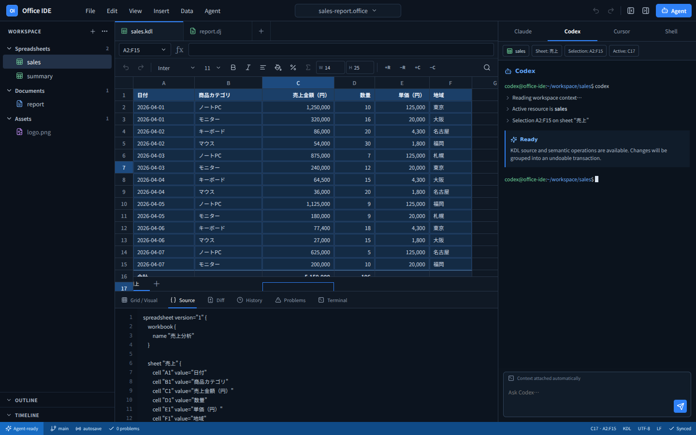
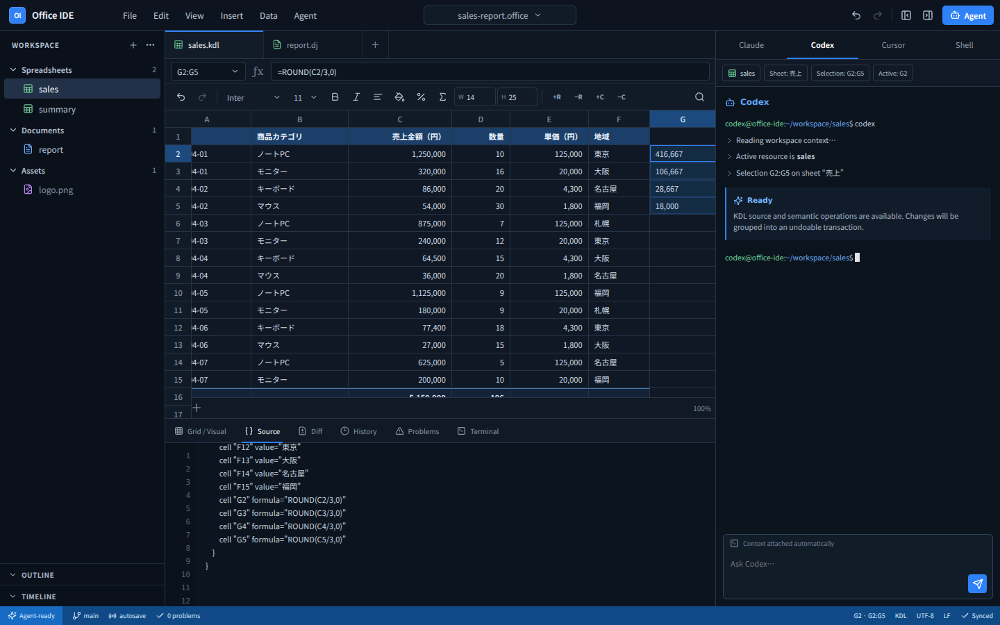

# Office IDE

Agent-first Office Suite。Spreadsheet / Document / Source / Git / Terminal / Agentを、同じローカルworkspaceで扱うためのデスクトップIDEです。



現在の実装はPhase 0とPhase 1 Spreadsheet Coreの縦方向sliceを対象にしています。

- React + TypeScript + ViteによるIDE shell
- Tauri 2 / Rust IPCの土台
- resource typeに依存しないExplorerとeditor tab
- Spreadsheet IR
- KDL sourceのparse / serialize
- semantic operationとUndo / Redo
- cell style、row height、column widthのsemantic editing
- row/column挿入・削除とA1数式参照のshift
- Shiftクリックによるrange選択、相対数式フィル、複数行列の一括挿入・削除
- 四則演算、比較、参照、range、集計・論理・文字列・丸め関数、IF、循環参照検出を含むformula engine
- 数式構文診断とGrid / Problemsへのエラー表示
- GridとSourceの双方向更新デモ
- Agent context pane、Diff、History、Problems、Terminal surface
- command paletteとkeyboard shortcuts

## Grid / Sourceの同期

セルまたは数式バーへ入力し、Enterかフォーカス移動で確定すると、Spreadsheet IRを経由してKDL Sourceへ反映されます。数式セルを選び、Shiftクリックで範囲を広げて`Σ`を押すと、`$`付き絶対参照を維持したまま相対参照をフィルできます。変更全体は1 transactionなのでUndo / Redoも1回です。



## 開発

```bash
bun install
bun run dev
```

Desktop shellを起動する場合：

```bash
bun run tauri dev
```

## 検証

```bash
bun run typecheck
bun test
bun run build
```

## 次の実装

1. Univer Sheets adapterを`ResourceEditor`として接続
2. KDL 2.0完全parserへ差し替え
3. formula engineの日付・配列・sheet間参照とnamed style
4. Tauri channel + `portable-pty`によるterminal接続
5. `sheetctl`とlocal IPC
6. AST-preserving source patch
