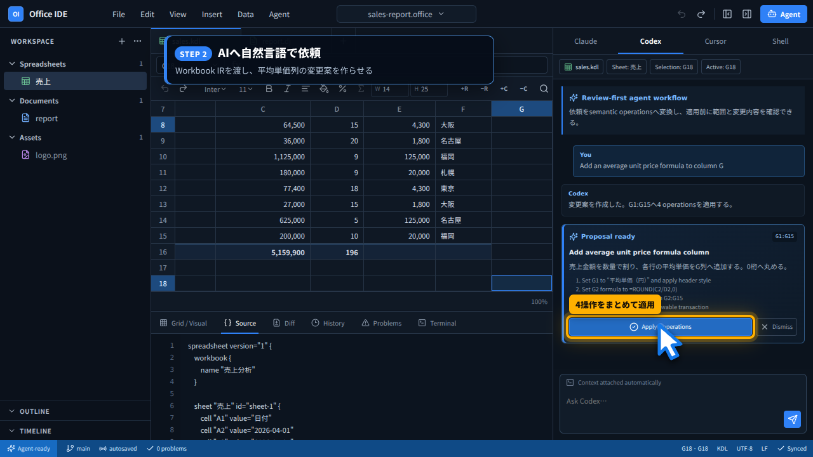
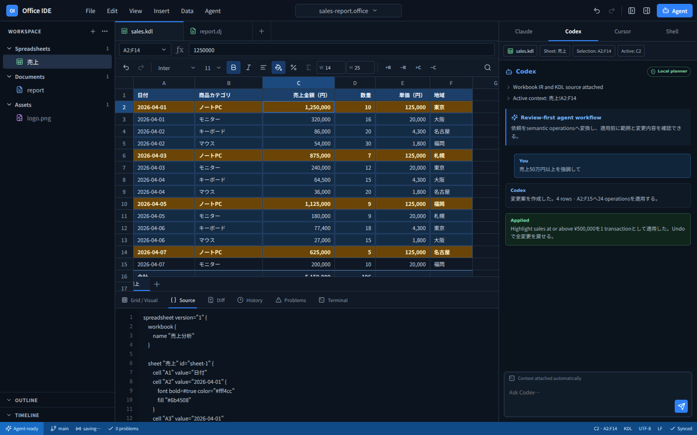
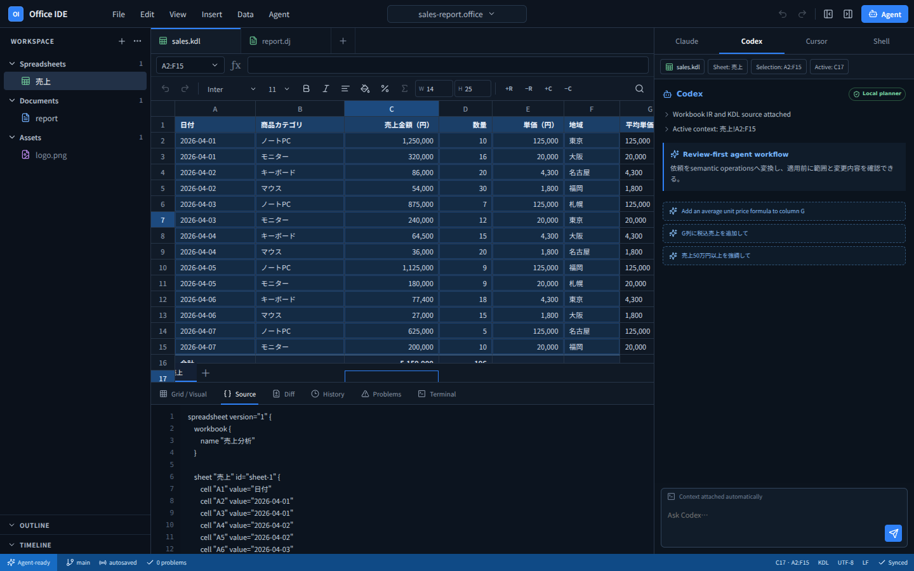
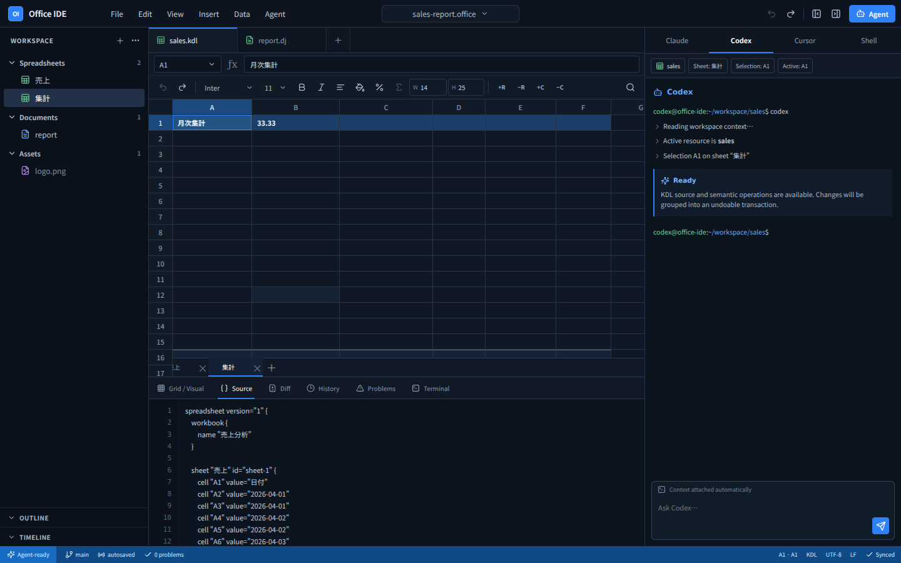

# Office IDE

Agent-first Office Suite。Spreadsheet / Document / Source / Git / Terminal / Agentを、同じローカルworkspaceで扱うためのデスクトップIDEです。


## Demo

<video src="https://raw.githubusercontent.com/linkalls/office-ide/main/docs/media/office-ide-agent-demo.mp4" poster="https://raw.githubusercontent.com/linkalls/office-ide/main/docs/images/office-ide-agent-review.png" controls width="100%"></video>

[▶ 38秒のガイド付きAgent workflow MP4を直接開く](docs/media/office-ide-agent-demo.mp4)

大型カーソル、移動軌跡、対象枠、クリック波紋、7段階の字幕付きです。数式の1文字入力から、自然言語の依頼、適用前レビュー、4つのsemantic operation、Agent attribution付きHistory、UndoでG列が消える瞬間、Redo、再起動後のautosave recoveryまで、カーソルを結果へ戻しながら実際に操作しています。

[▶ Multi-sheet / autosaveの14秒デモ](docs/media/office-ide-demo.mp4)

現在の実装はPhase 0とPhase 1 Spreadsheet Coreの縦方向sliceを対象にしています。

- React + TypeScript + ViteによるIDE shell
- Tauri 2 / Rust IPCの土台
- resource typeに依存しないExplorerとeditor tab
- Spreadsheet IR
- KDL sourceのparse / serialize
- semantic operationとUndo / Redo
- cell style、row height、column widthのsemantic editing
- row/column挿入・削除とA1数式参照のshift
- Shiftクリックによるrange選択、相対数式フィル、複数行列の一括挿入・削除
- 複数sheetの作成・切替・inline改名・削除とUndo
- stable sheet ID付きKDL、version付きautosave snapshot、再読み込み時の安全なrecovery
- 四則演算、比較、参照、range、集計・論理・文字列・丸め関数、IF、循環参照検出を含むformula engine
- 数式構文診断とGrid / Problemsへのエラー表示
- GridとSourceの双方向更新デモ
- review-first Agent workflow（自然言語 → proposal → semantic operations → apply）
- Workbookの現在値を走査する条件付き行強調（日本語/英語、円/万円/k対応）
- Agent attribution付きHistory / Diffと、Agent変更全体のUndo / Redo
- セルへの直接キーボード入力、Enter / Shift+Enter / Tab / Shift+Tabナビゲーション
- Agent context pane、Problems、Terminal surface
- command paletteとkeyboard shortcuts

## AI workflow

Agent paneへ `Add an average unit price formula to column G`、`G列に税込売上を追加して`、`売上50万円以上を強調して` と入力すると、現在のWorkbook IRを読んで変更案を作ります。提案された範囲・式・操作を確認してからApplyすると、すべてが1つのsemantic transactionとしてGrid、KDL Source、Diff、Historyへ反映されます。変更者はAgentとして記録され、Undo 1回で提案全体を戻せます。



しきい値強調はC列の実データを走査し、条件を満たした行だけをA:Fへstyle operationとして生成します。サンプルでは50万円以上の4行を検出し、24 operationsを1 transactionで適用します。



現在のplannerはPhase 2の安全な境界を先に検証するための決定的なlocal rule engineです。外部LLMやCodex CLIを呼んだように見せてはいません。実process / PTY / CLI接続は次のPhase 2実装です。



## Grid / Sourceの同期

セルまたは数式バーへ入力し、Enterかフォーカス移動で確定すると、Spreadsheet IRを経由してKDL Sourceへ反映されます。数式セルを選び、Shiftクリックで範囲を広げて`Σ`を押すと、`$`付き絶対参照を維持したまま相対参照をフィルできます。変更全体は1 transactionなのでUndo / Redoも1回です。

Gridのセルは通常のキーボード入力に対応しています。Enter / Shift+Enterで上下、Tab / Shift+Tabで左右へ確定しながら移動します。数式内の関数引数カンマは保持されるため、`=ROUND(10/3,2)`もそのまま`3.33`として評価されます。


## Multi-sheet / Autosave

Explorerと下部sheet tabは同じWorkbook IRを参照します。`＋`でsheetを追加し、tabをダブルクリックして改名できます。sheet削除はsemantic transactionとして記録されるためUndo可能です。validなWorkbookはKDLとしてversion付きsnapshotへ自動保存され、再読み込み時はparserとdiagnosticsを通過したデータだけが復元されます。



## 開発

```bash
bun install
bun run dev
```

Desktop shellを起動する場合：

```bash
bun run tauri dev
```

## 検証

```bash
bun run typecheck
bun test
bun run build
bun run demo:record
```

## 次の実装

1. Univer Sheets adapterを`ResourceEditor`として接続
2. KDL 2.0完全parserへ差し替え
3. formula engineの日付・配列・sheet間参照とnamed style
4. Tauri channel + `portable-pty`によるterminal接続
5. Codex / Claude CLI launcher、`sheetctl`、local IPCをlocal plannerのproposal境界へ接続
6. AST-preserving source patch
